# Praktikum React

## Hasil dari langkah praktikum pertama
**Manampilkan judul praktikum dan halaman utama**
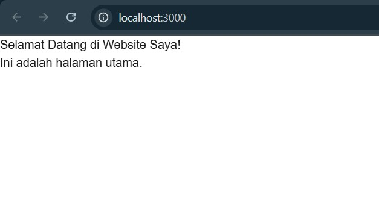

## Hasil dari langkah praktikum kedua blog.js
**Membuat halaman blog dengan SSG, dan nanti akan melihat daftar post yang diambil dari API eksternal.**
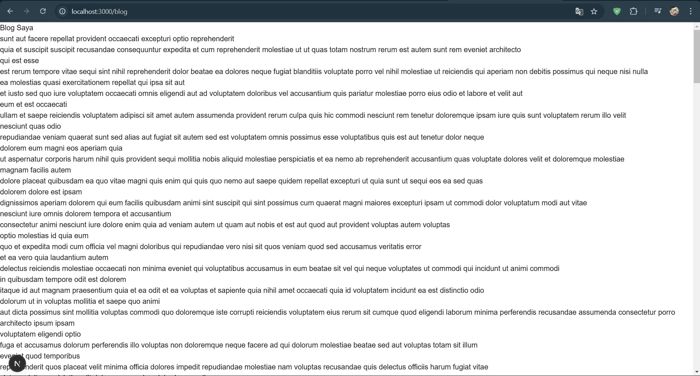

## Hasil dari langkah praktikum ketiga slug.js
**Membuat halaman dinamis berdasarkan slug, dan nanti akan melihat halaman yang menampilkan slug dari URL.**
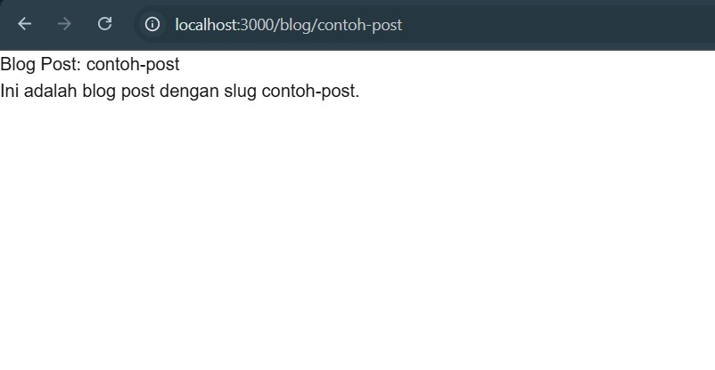

## Hasil dari langkah praktikum keempat Products.js
**Membuat API route yang mengembalikan daftar produk:**
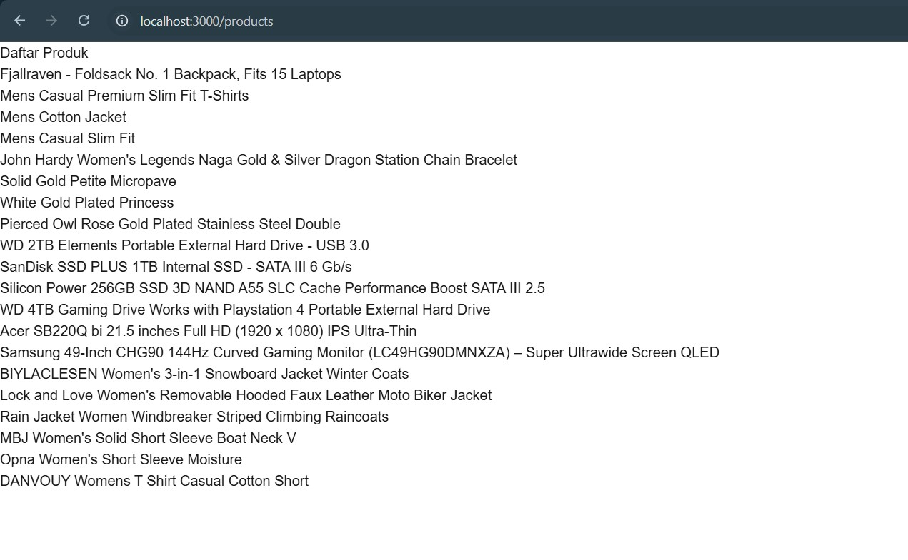

## Hasil dari langkah praktikum kelima Link Component
**Memodifikasi pages/index.tsx untuk menambahkan sebuah fitur element href menggunakan link>**
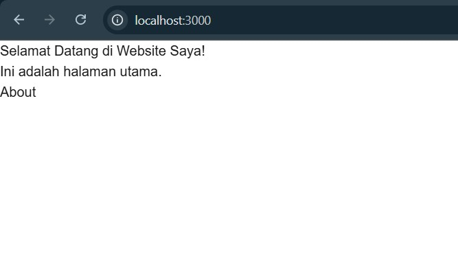
**Setelah klik "About"**
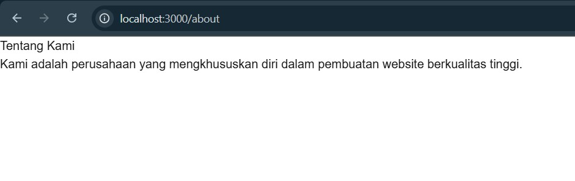

## Hasil dari langkah praktikum keenam Tugas
### 1. Buat halaman baru dengan menggunakan Static Site Generation (SSG) yang menampilkan daftar pengguna dari API https://jsonplaceholder.typicode.com/users.
**Buat file users.js dan folder baru kemudian tambahkan file baru id.js**
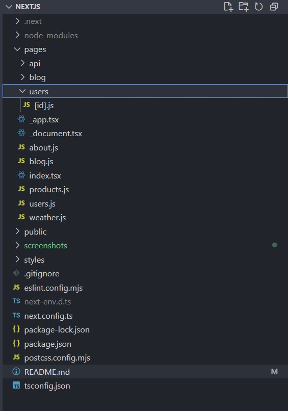

### 2. Implementasikan Dynamic Routes untuk menampilkan detail pengguna berdasarkan ID.
**kode users.js ============================================================================**
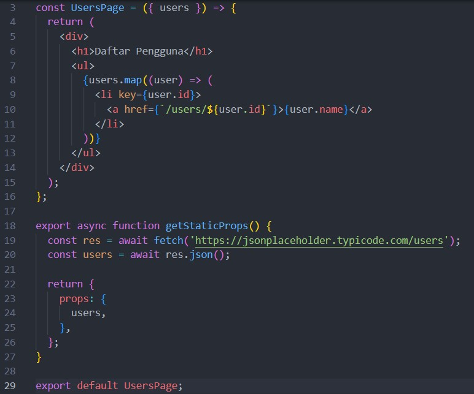
**kode id.js ===============================================================================**
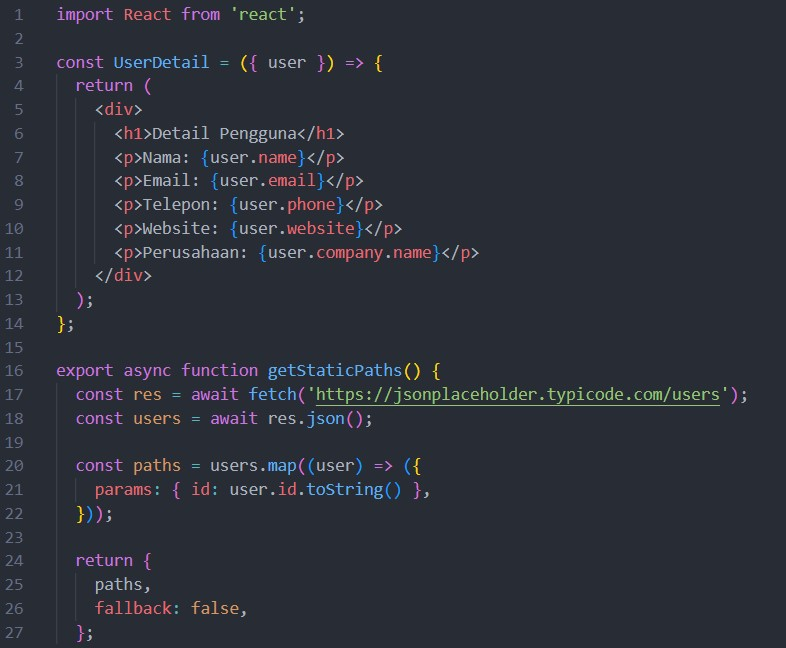
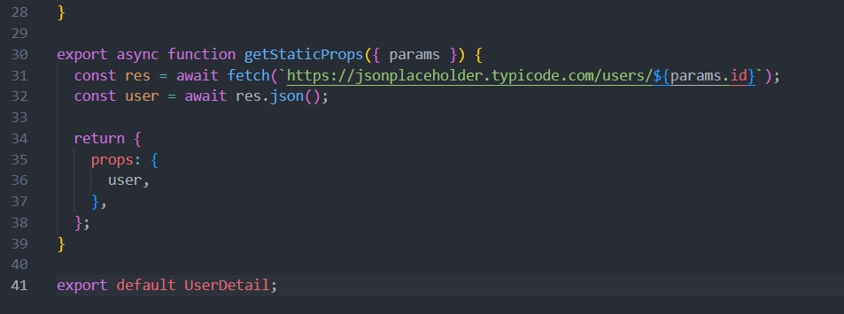
**Hasil pada halaman users =================================================================**
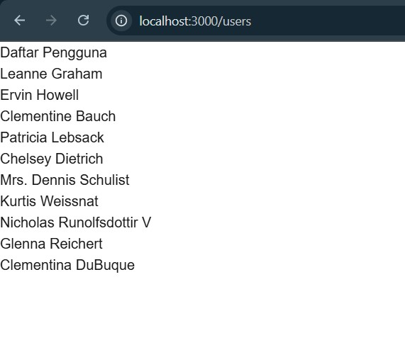
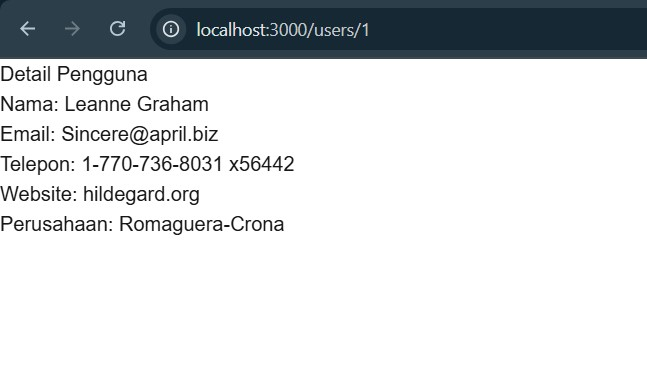

### 3. Buat API route yang mengembalikan data cuaca dari API eksternal (misalnya, OpenWeatherMap) dan tampilkan data tersebut di halaman front-end.
**Kode weather.js ==========================================================================**
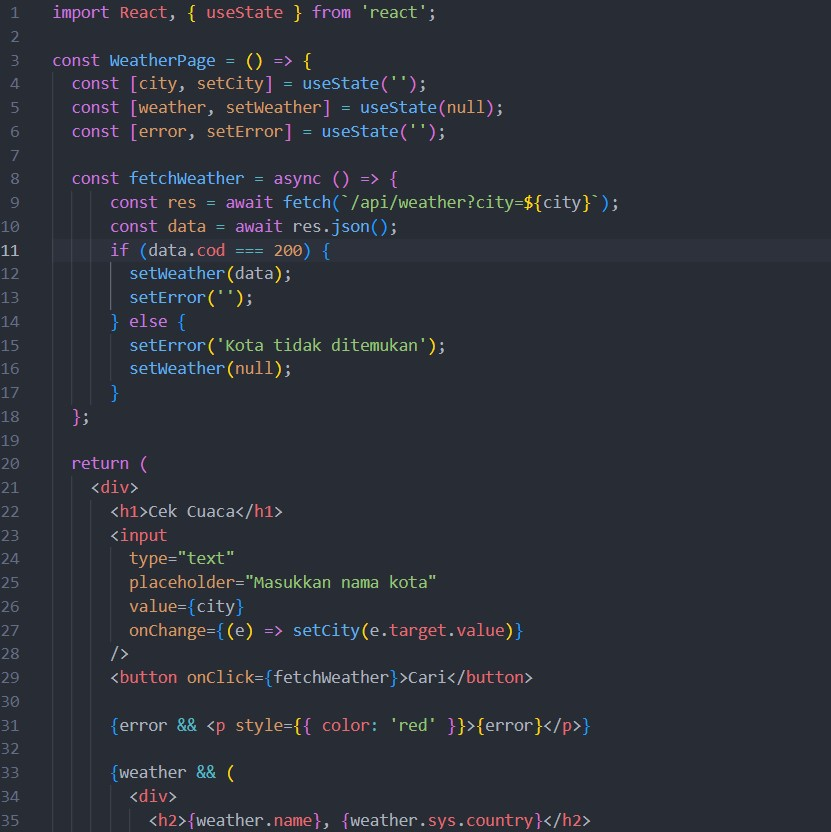
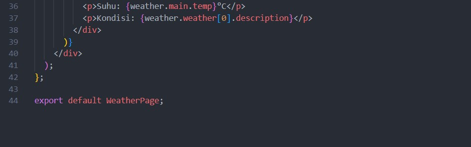
**Kode api\weather.js dan disitu untuk apikey saya hidden menggunakan .env demi keamanan**
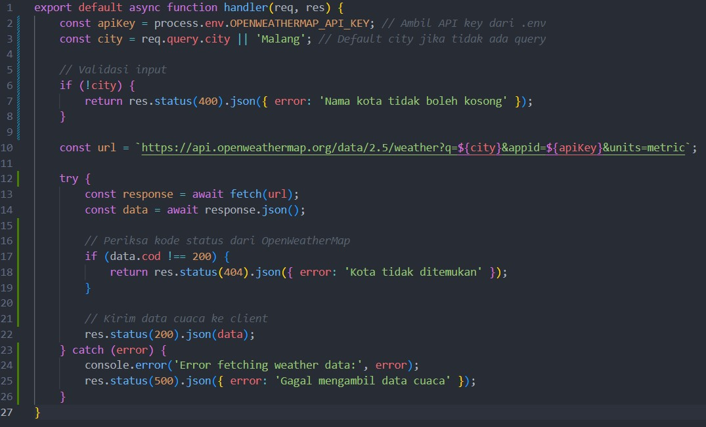
**Buat akun OpenWeatherMap terlebih dahulu untuk mendapatkan sebuah api yang nantinya digunakan sebagai apikey**
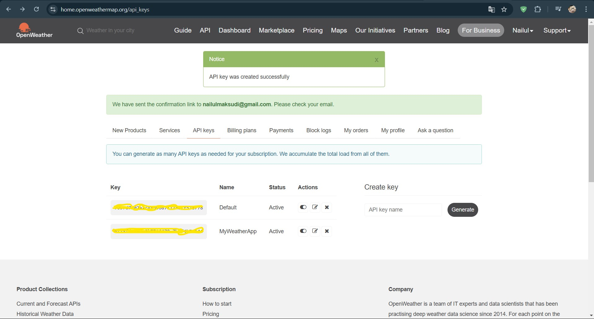
**Hasilnya silahkan isikan kota mana yang dimasukkan di inputan tersebut**
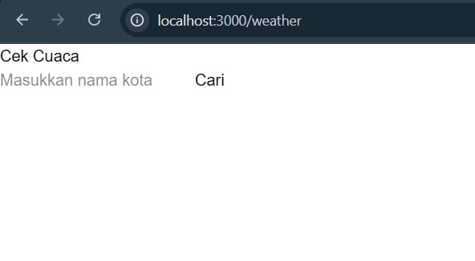
**Hasilnya misalnya jika diisi dengan kota-kota tertentu**
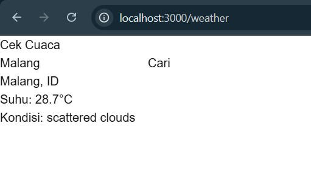
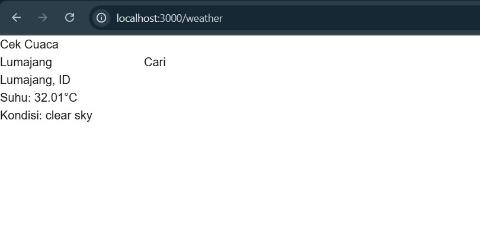
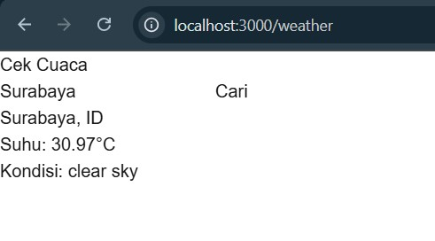

## Hasil
**Jadi kembali lagi pada halaman pertama, yang mana saya menambahkan beberapa element href link> agar bisa menuju ke url yang di tuju tanpa harus mengetik manual.**
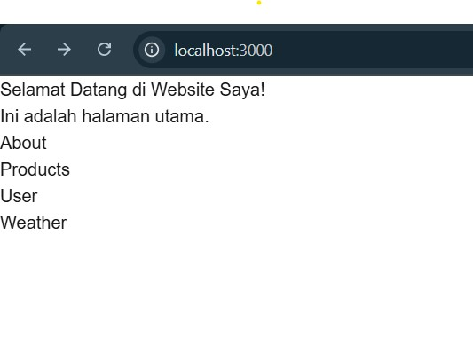
